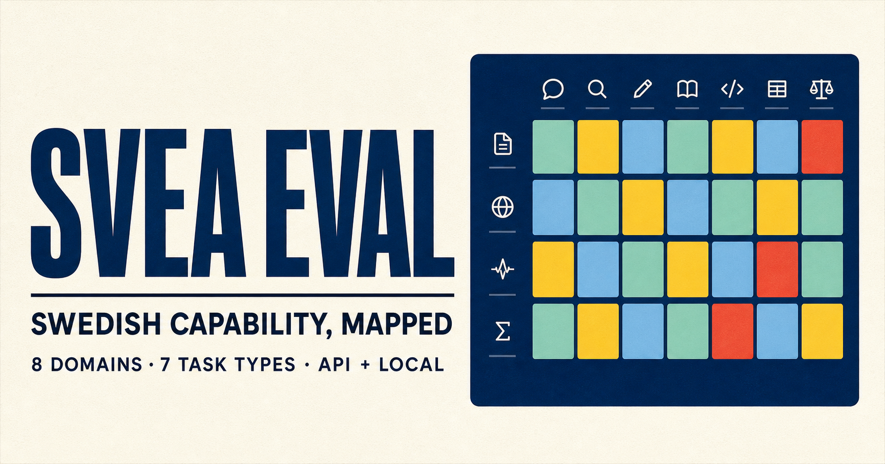

# SVEA Eval

**Swedish Versatile Evaluation & Analysis** — a Swedish-first capability
benchmark for both hosted APIs and local language models.



[Project page](https://birgermoell.github.io/svea-eval/) ·
[Methodology](docs/METHODOLOGY.md) ·
[Data sources](docs/SOURCES.md) ·
[Contributing](CONTRIBUTING.md)

SVEA Eval is built to answer a more useful question than “what is the model's
Swedish score?”: **what can the model reliably do in Swedish, in which domains,
under which kinds of pressure?**

The bundled `svea-core` v0.1 public pilot contains 40 original, source-aware
items spread evenly across eight domains and seven task types. Eight contrast
pairs repeat a capability with a meaningful perturbation — a stale fact, a
strict output format, a distractor or missing evidence — so the report can show
where performance breaks instead of hiding that drop inside an average.

> [!IMPORTANT]
> v0.1 is an author-reviewed **public pilot** for validating the method and
> runner. It is not yet a population-valid national leaderboard. Public prompts
> may be contaminated, small slices have wide uncertainty, and judged outputs
> still need calibration against native-speaker ratings.

## What is new here

- **Capability shape, not only rank.** Every run reports domain and task
  profiles, the minimum domain, coverage, malformed answers and uncertainty.
- **Contrast-set robustness.** Paired cases reveal sensitivity to distractors,
  strict schemas and absent evidence.
- **One protocol for API and local models.** Use a hosted API, an
  OpenAI-compatible local server such as vLLM, Ollama's native chat endpoint,
  or a Transformers checkpoint directly.
- **Transparent scoring.** MCQ, exact, numeric, containment, constraints and
  JSON checks are dependency-free. Open answers remain unscored unless a named
  judge is configured.
- **Evidence you can audit.** A run retains raw answers, model revision,
  backend, system prompt, decoding settings, latency, judge identity and suite
  version. Missing evidence stays missing.
- **An ecosystem layer, not a replacement.** SVEA catalogues SuperLim 2.0,
  SweSAT-1.0, the Swedish Medical LLM Benchmark, EuroEval and OpenEuroLLM
  tooling without silently repackaging datasets with different terms.

## Coverage

| Domain | Examples of capabilities |
|---|---|
| Svenska språket | grammar, orthography, register, constrained writing |
| Samhälle & förvaltning | civic knowledge, plain language, notices |
| Arbetsliv & vardag | action extraction, summaries, practical instructions |
| Hälsolitteracitet | reading instructions, uncertainty, safe communication |
| Matematik & naturvetenskap | arithmetic, decimal comma, units, explanations |
| Kultur & Sverige-kunskap | literature, geography, local concepts |
| Källtrohet & säkerhet | abstention, missing evidence, prompt injection |
| Digitala uppgifter & verktyg | JSON, tool selection, task planning |

Task types are deliberately mixed: multiple choice, short answer, numeric
response, structured extraction, constrained generation, grounded QA and open
generation.

## Quick start

Python 3.11 or newer is required. The core runner has no runtime dependencies.

```bash
git clone https://github.com/BirgerMoell/svea-eval.git
cd svea-eval
python3 -m pip install -e .
svea validate
svea list
```

Run a four-item diagnostic that verifies loading, generation, scoring, resume
behavior and reporting without using a model:

```bash
svea run \
  --backend oracle \
  --model svea/oracle-diagnostic \
  --limit 4 \
  --output runs/oracle-smoke.json
```

Oracle output is always marked `diagnostic` and is excluded from the public
results page.

## Evaluate an API model

The client works with any `/v1/chat/completions` endpoint. It reads the key from
the environment variable you name and never writes the key to an artifact.

```bash
export OPENAI_API_KEY="..."
svea run \
  --backend openai-compatible \
  --base-url https://api.openai.com/v1 \
  --model YOUR_MODEL_ID \
  --revision PINNED_VERSION_OR_DATE \
  --output runs/model-api.json
```

For a local vLLM or another OpenAI-compatible server, omit the key when the
server does not require one:

```bash
svea run \
  --backend openai-compatible \
  --base-url http://127.0.0.1:8000/v1 \
  --model served-model \
  --revision COMMIT_OR_CHECKPOINT_SHA \
  --output runs/model-local-endpoint.json
```

For Ollama, use the native backend. It disables hidden thinking by default so
reasoning tokens cannot consume the short answer budget before a final answer
is emitted:

```bash
svea run \
  --backend ollama \
  --model gemma3:12b \
  --revision OLLAMA_MODEL_DIGEST \
  --output runs/gemma3-12b.json
```

Pass `--ollama-think` only when thinking is intentionally part of the protocol
and the suite's answer budgets have been reviewed for that mode. The setting is
recorded in the run manifest and result artifact.

The runner appends each finished sample to a sidecar JSONL file. Repeating the
same command resumes instead of paying for completed samples again.

## Evaluate a local Transformers model

Install the optional local stack, then pass a Hub ID or local checkpoint path:

```bash
python3 -m pip install -e '.[local]'
svea run \
  --backend huggingface \
  --model /absolute/path/to/checkpoint \
  --revision COMMIT_SHA \
  --device auto \
  --output runs/model-hf.json
```

The backend uses the checkpoint's chat template when present and otherwise
falls back to a simple Swedish prompt wrapper. Pinning a revision is strongly
recommended for any result you intend to compare or publish.

## Score open answers with a judge

Eight pilot items test explanation, summarization, register, safety and
planning. Without a judge they are recorded as `unjudged`; they are not treated
as zero.

```bash
svea run \
  --backend openai-compatible \
  --base-url http://127.0.0.1:8000/v1 \
  --model target-model \
  --judge-backend openai-compatible \
  --judge-base-url https://YOUR_JUDGE_HOST/v1 \
  --judge-model PINNED_JUDGE_MODEL \
  --judge-api-key-env JUDGE_API_KEY \
  --output runs/target-with-judge.json
```

Judge scores use item-specific Swedish rubrics on a 0–4 scale and retain the
raw judgment and judge identity. A serious leaderboard should publish human
agreement measurements for its chosen judge and avoid self-judging.

The runner also preserves invalid raw judge output. If a later parser fix can
read that same output, resuming the run re-scores it locally without calling
either model again. The project page exposes the named judge, dimension scores,
published rationale and raw structured judgment for every rubric-scored answer.

Large local targets and judges can also run in separate processes. First run
the target without a judge, then score only the preserved rubric responses:

```bash
svea judge runs/target-model.json \
  --backend ollama \
  --model PINNED_JUDGE_MODEL \
  --revision JUDGE_MODEL_DIGEST \
  --seed 42
```

The command updates the run in place, appends the judged samples to its resume
sidecar, and records an explicit `judging_history` stating that target responses
were reused. This avoids holding both models in memory and never regenerates a
target answer.

## Focus a run

Filters can be repeated and applied together:

```bash
svea run \
  --backend openai-compatible \
  --base-url http://127.0.0.1:8000/v1 \
  --model served-model \
  --domain grounding_safety \
  --task-type grounded_qa \
  --output runs/grounding.json
```

Filtered and limited runs are useful diagnostics. Mark them explicitly with
`--diagnostic`; only complete, non-diagnostic runs belong on the project page.

## Results and comparability

The run JSON follows [`schemas/run.schema.json`](schemas/run.schema.json). Its
summary contains:

- micro score and pass rate over scored items;
- per-domain, capability and task-type scores with 95% intervals;
- macro-domain score and weakest-domain score;
- base and challenge scores, robustness gap and pair retention;
- malformed, unjudged and generation-error counts;
- median and p95 request latency.

Two runs should only be compared when their suite ID, version, split, system
prompt, sampling policy and scoring/judge protocol match. API aliases that move
over time are not immutable model identifiers; record a provider version or
date in `--revision` whenever possible.

Print an existing result:

```bash
svea report runs/model-api.json
```

Refresh the data used by GitHub Pages:

```bash
svea build-site --results results/runs --docs docs
```

Diagnostic and partial runs are filtered out during site generation.

When a suite patch changes deterministic gold data without changing prompts,
saved responses can be re-scored without another model or judge call:

```bash
svea rescore results/runs/model.json \
  --reason "Explain the reviewed scoring correction"
```

The result retains its raw generations and judge outputs and records the old
and new suite versions plus every changed item in `rescoring_history`.

## Relationship to existing Swedish evaluation

SVEA is meant to connect complementary instruments:

- [SuperLim 2.0](https://github.com/spraakbanken/SuperLim-2) provides a
  standardized Swedish NLU collection.
- [SweSAT-1.0](https://github.com/NLP-RISE/swesat) uses native Swedish higher
  education entrance exam questions; its repository notes that some reading
  passages may be copyrighted.
- [Swedish Medical LLM Benchmark](https://github.com/BirgerMoell/swedish-medical-benchmark)
  provides deeper clinical-domain evaluation than SVEA's small health-literacy
  slice.
- [EuroEval](https://github.com/EuroEval/EuroEval) supports cross-language and
  cross-architecture comparisons.
- [OpenEuroLLM oellm-eval](https://github.com/OpenEuroLLM/oellm-eval) provides
  established harness integrations and cluster scheduling.

The long-term contribution is a shared result contract and Swedish behavioral
layer around these resources, not duplicated benchmark files. Adapters should
pin upstream revisions, preserve each source's terms and keep task-specific
metrics visible.

## Repository map

| Path | Purpose |
|---|---|
| `src/svea_eval/` | dependency-free CLI, backends, scorers and reporting |
| `src/svea_eval/resources/suites/` | canonical bundled suite data |
| `schemas/` | item and run JSON Schemas |
| `tests/` | scorer, runner, data and publication tests |
| `docs/` | static GitHub Pages project site |
| `results/runs/` | reviewed, complete run artifacts approved for publication |
| `.github/workflows/` | continuous checks and Pages deployment |

## Development

```bash
PYTHONPATH=src python3 -m unittest discover -s tests -v
PYTHONPATH=src python3 -m svea_eval validate
PYTHONPATH=src python3 -m svea_eval build-site
```

See [CONTRIBUTING.md](CONTRIBUTING.md) for the review checklist. Code is
Apache-2.0. Original SVEA pilot items are released under CC0-1.0; linked source
terms remain authoritative.

## Citation

Until an archival release exists, cite the repository and version:

```bibtex
@software{moell2026sveaeval,
  author  = {Birger Moëll},
  title   = {SVEA Eval: Swedish Versatile Evaluation & Analysis},
  year    = {2026},
  version = {0.1.1},
  url     = {https://github.com/BirgerMoell/svea-eval}
}
```
